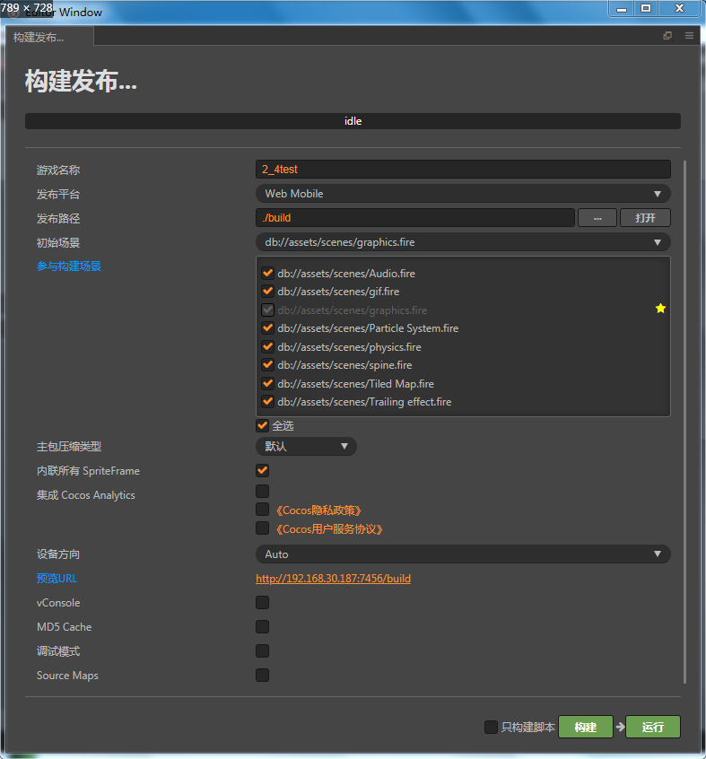
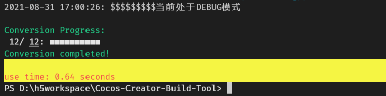
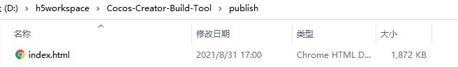

# Cocos-Creator-Build-Tool
$\underline{可以解决 Cocos Creator 2.4x 版本 Web包 跨域问题 打包成单Html}$
## 构建预览


## 环境配置
### 工具
**$\color{blue}Cocos Creator 2.4+$**


**$\color{blue}Python 3.x$**


**$\color{blue}VScode$**


## 文件结构
main.py: 入口文件

bin: 配置文件目录

cc_web_mobile: web包父目录

publish: 输出目录 打包后的html输出目录

log: 程序运行后自生成 程序运行日志 同一天的日志将输出在一个文件内部


## 源码介绍
### 处理流程
**您需要依次包含**
- style-mobile.css
- settings.js
- cocos2d-js-min.js
- physics-min.js <需要判断是否存在 仅在勾选物理模块后存在此文件>
- 资源内嵌assets目录下的所有资源转换成base64 并 以assets为相对目录作为key值 存入 window.resMap对象中
- downloader.js 将新的加载方法注入
- main.js
- window.boot() 启动


### 资源内嵌处理
```Python
    def HashAssets(dir, filter='', resMap={}):
            def convert2base64(url, str1):
                binBuffer = IUtils.fromFile(url,'rb',None)
                return str1 +  str(base64.b64encode(binBuffer), encoding='utf-8')
            def convert2text(url):
                return IUtils.fromFile(url)

            pConvertFunctor = {
                '.json': lambda x: convert2text(x),
                '.js': lambda x: convert2text(x),
                '.wasm': lambda x: convert2base64(x, ''),
                '.png': lambda x: convert2base64(x, ''),
                '.jpg': lambda x: convert2base64(x, ''),
                '.gif': lambda x: convert2base64(x, ''),
                '.wav': lambda x: convert2base64(x, ''),
                '.bin': lambda x: convert2base64(x, ''),
                '.plist':lambda x: convert2text(x),
                '.mp3': lambda x: convert2base64(x, ''),
                '.ttf': lambda x: convert2base64(x,''),
                '.pem':lambda x: convert2text(x),
                '.dbbin':lambda x: convert2base64(x,''),
                '.mp4':lambda x: convert2base64(x,''),
                '.atlas':lambda x: convert2text(x)
            }
          
            for root, dirs, files in os.walk(dir):
                path = root.replace(filter, '', 1).replace('\\', '/')
                for f in files:
                    url = '%s/%s' % (path, f)
                    ext = os.path.splitext(f)[1]
                    resMap[url] = pConvertFunctor[ext](root + '/' + f)
            return resMap
        bar.step()

        resMap = HashAssets(project_root+"/assets",project_root+"/")
        resMapContent = json.dumps(resMap, ensure_ascii=False)
        resMapContent = IUtils.JavaScript('window.resMap = ' + resMapContent)
```

### 资源加载处理
**$\color{#EE7E2A}通过 cc.assetManager.downloader.register 接口重写 资源加载处理$**
```JavaScript
    function loadScript(url) {
        let source = window.resMap[url];
        var d = document,
            s = document.createElement('script');
        s.type = 'text/javascript';
        s.text = source;
        d.body.appendChild(s);
    }
    function downloadBundleHandler(nameOrUrl, options, onComplete) {
        let bundleName = cc.path.basename(nameOrUrl);
        var version = options.version || cc.assetManager.downloader.bundleVers[bundleName];
        let suffix = version ? version + '.' : '';
        let url = `assets/${bundleName}`;

        let js = `assets/${bundleName}/index.${suffix}js`;
        if (!loadedScripts[js]) {
            loadScript(js);
            loadedScripts[js] = true;
        }

        options.__cacheBundleRoot__ = bundleName;
        var config = `${url}/config.${suffix}json`;
        downloadJson(config, options, function(err, data) {
            if (err) {
                onComplete && onComplete(err);
                return;
            }
            data.base = url + '/';
            onComplete && onComplete(null, data);
        });
    };
    function downloadText(url, options, onComplete) {
        let data = window.resMap[url];
        onComplete(null, data);
    };
    cc.assetManager.downloader.register('bundle', downloadBundleHandler);
    cc.assetManager.downloader.register('.plist', downloadText);
```
[downloader.js文件](./bin/downloader.js)


## 输出
**$\color{blue}log$**


**$\color{blue}单html路径$**


$\underline{ 程序结束后 运行输出的日志 保存在log 目录下 您可以通过日志检查相关异常 }$


## 案例
[案例Html文件](./publish/index.html)